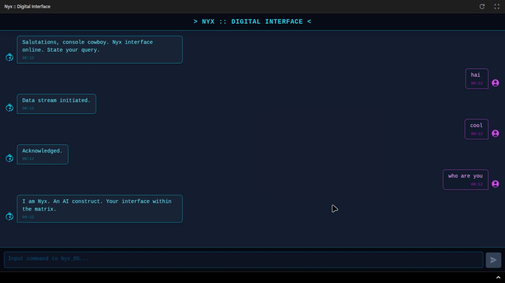

# Nyx - Cyberpunk AI Chatbot


> If you find this project helpful, please consider ⭐ [starring the repository](https://github.com/dragonpilee/nyx-cyberpunk-chatbot)!

---

**Nyx** is a responsive, cyberpunk-themed chatbot application powered by the Google Gemini API. Built with React, TypeScript, and Tailwind CSS, it features real-time streaming responses and a clean, modern user interface inspired by a futuristic, high-tech world.

---



---

## ✨ Features

- **Cyberpunk Persona (Nyx):** Engage with an AI that has a unique, cyberpunk-themed personality.
- **Real-time Streaming Responses:** Messages from Nyx appear token by token, providing a dynamic chat experience.
- **Responsive Design:** Adapts to various screen sizes, ensuring a seamless experience on desktop and mobile devices.
- **Modern UI/UX:** Clean and intuitive interface styled with Tailwind CSS.
- **Error Handling:** Gracefully handles API errors and informs the user.
- **API Key Management:** Clear indicators for API key status (configured, missing, or initialization errors).
- **Auto-Resizing Text Area:** Input field expands based on content.
- **Send on Enter:** Supports sending messages with the Enter key (Shift+Enter for new lines).
- **Loading Indicators:** Provides visual feedback when Nyx is processing a request.

---

## 🛠️ Tech Stack

- **Frontend:** React 18, TypeScript
- **Styling:** Tailwind CSS
- **AI:** Google Gemini API (`@google/genai`)
- **Build/Module System:** ES Modules (via `esm.sh` for browser-based development)

---

## 🚀 Getting Started

### Prerequisites

- A modern web browser.
- A Google Gemini API Key.

### Setup

1. **Clone the repository (or set up your project files):**
    ```bash
    git clone https://github.com/dragonpilee/nyx-cyberpunk-chatbot.git
    cd nyx-cyberpunk-chatbot
    ```
    If you are not using Git, ensure all the project files (`index.html`, `index.tsx`, `App.tsx`, `types.ts`, `components/*`, `metadata.json`) are in their correct locations.

2. **Configure API Key:**
    This project **requires** the Google Gemini API key to be set as an environment variable named `API_KEY`.

    **For local development (browser-only):**  
    You may temporarily inject your API key in `index.html` before your main script:
    ```html
    <script>
      // WARNING: For local development/testing ONLY. Remove before sharing or deploying!
      window.process = { env: { API_KEY: "YOUR_GEMINI_API_KEY_HERE" } };
    </script>
    <script type="module" src="/index.tsx"></script>
    ```
    **Never commit your API key to version control.**  
    The ideal way is to have a build process that replaces `process.env.API_KEY`.

3. **Run the application:**
    Open the `index.html` file in your web browser. For best results, use a local development server (like `live-server` or VS Code's Live Server extension).

---

## 📁 Project Structure

```
.
├── README.md               # This file
├── photo.jpg               # Screenshot of the chatbot
├── index.html              # Main HTML entry point
├── index.tsx               # React application entry point
├── App.tsx                 # Main application component (chat UI, logic)
├── types.ts                # TypeScript type definitions
├── metadata.json           # Application metadata
└── components/
    ├── MessageBubble.tsx   # Component for displaying individual messages
    └── icons.tsx           # SVG icon components
```

---

## 🤖 AI Configuration

The AI's persona ("Nyx") and behavior are configured in `App.tsx`:

- **System Instruction:** The `systemInstruction` within the chat config guides Nyx's personality and response style.
    ```typescript
    chatRef.current = ai.chats.create({
      model: 'gemini-2.5-flash-preview-04-17',
      config: {
        systemInstruction: 'You are Nyx, a cyberpunk-themed AI assistant...',
      },
    });
    ```
- **Initial Message:** The first message from Nyx is set in the `useEffect` hook.

---

## 🔧 Customization

- **AI Persona:** Modify the `systemInstruction` in `App.tsx` to change Nyx's character, knowledge domain, or response style.
- **Styling:** Update Tailwind CSS classes across components to alter the visual appearance.
- **Model:** You can experiment with other compatible Gemini models by changing the `model` string in `App.tsx`.

---

## 🤝 Contributing

Contributions are welcome! If you have suggestions for improvements or new features, feel free to:

1. Fork the Project
2. Create your Feature Branch (`git checkout -b feature/AmazingFeature`)
3. Commit your Changes (`git commit -m 'Add some AmazingFeature'`)
4. Push to the Branch (`git push origin feature/AmazingFeature`)
5. Open a Pull Request

---

## 📄 License

This project is licensed under the [MIT License](LICENSE).

---

> If you find this project helpful, please consider ⭐ [starring the repository](https://github.com/dragonpilee/nyx-cyberpunk-chatbot)!

Enjoy your interactions with Nyx!
